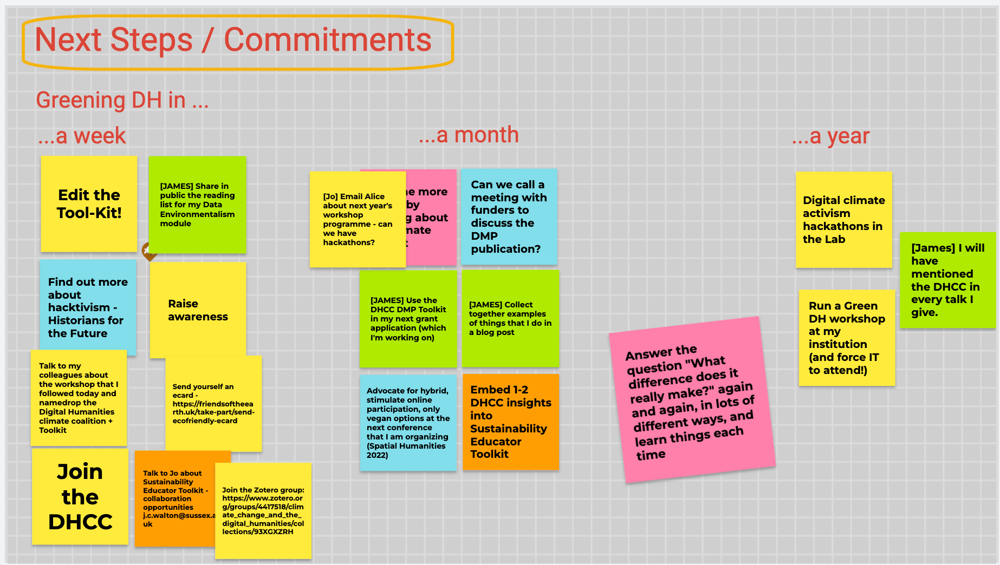

# DH Benelux 2022 Workshop

*The action-items on the group [Jamboard](https://jamboard.google.com/d/1XfFs1dEdQ_vOWfpuybf7H4dKCQbglgGhv3u6tkZTMmM/viewer?f=0) after the workshop finished (31 May 2022)*

## Description

In this workshop we underscored that as humanities researchers it is our role to probe the values, the power structures, and the future imaginaries that underpin sustainable solutions. Moreover, given the immense and monopolistic power wielded by the global tech sector, and the critiques of this power that are part of the Digital Humanities, this community is well positioned to create change and demonstrate to our colleagues and collaborators how change can happen. Our use of technology and infrastructure should be informed by the ways corporate economic, cultural, and scientific power perpetuates and exacerbates the crisis. Choosing a hardware or hosting provider, for example, should mean considering direct environmental impacts, broader environmental policies and record of the provider, and more broadly still, the kinds of collective future that such a collaborative encounter presupposes. We should be able to candidly explore the complex and sometimes contradictory nature of our ecological impact: we should be able to measure and model where possible, while also creating context around our measurements, flagging uncertainties, and advocating for transforming wider conditions.

## Themes

1. decarbonising our research and teaching,
1. working at the intersection of humanities and digital technology to understand the role of data science in climate transition and climate justice,
1. transforming DH (and knowledge institutions) within broader transformations of society.

## Notes

Access the workshop notes on this [Etherpad Document](https://etherpad.wikimedia.org/p/DHCC-tool-kit-workshop).

## Structure

**Introductions. Refining questions, challenges, opportunities (40 mins)**

First, facilitated brainstorming and rapid co-production will refine questions, challenges, and opportunities around climate change and the digital humanities that are relevant in your local contexts. This part of the workshop will draw on the workshop model developed for the [November 2021 “Greening DH summit”](https://www.cdcs.ed.ac.uk/news/reflections-greening-digital-humanities-what-comes-next). This model balances the knowledge that time is fleeting and there is an impetus to act, with an awareness that participants will have variable expertise regarding the climate crisis, the energy/resource costs of digital technologies, and ‘green computing’ practices.

Access the [slides](https://docs.google.com/presentation/d/1-6Zny9WKYyq7hV-QGVMhDi_5ApPb7tdxYxiKado6c-0/edit?usp=sharing).

10 minute break

**Greening DH Toolkit (50 minutes)**

Second, participants will be asked to respond to sections of the DHCC’s work-in-progress Greening DH Toolkit. Specifically, participants will work in small groups to evaluate prototype sections of the toolkit, and to design their own implementation strategies for these sections. In keeping with the “RE-MIX” theme of the conference, we will discuss how agencies, funding bodies, and institutions in the Benelux region can be leveraged to enable implementation, as well as the barriers they might create.

- Introduction to the Tool-kit and how it is structured [5–10 min]
- Engaging with the tool-kit
  - Participants to examine a section of the tool-kit that speaks to their needs and interests [20 min]
  - Formulate responses–questions or provocations or suggest edits--and discuss as a group [25 min]

10 minute break

**Commitments (up to 60 minutes)**

Third, participants will be asked to vocalise their next steps, the commitments they make to their future DH work, so as to create both an individual and collective impetus to act. Participants who would like to continue to collaborate on the Toolkit after the workshop will be invited to join the DHCC Toolkit Action Group.

- How can we translate what we discussed into concrete next steps?
- Possible next steps inspired by an earlier DHCC workshop and maybe H4F workshops [10 min]
- Ask participants what commitments they can make for the next week, month, year, collect those commitments on Jamboard and discuss [20-25 min]
- Pick [a commitment and ecard](https://friendsoftheearth.uk/take-part/send-ecofriendly-ecard) and schedule the card to be sent in a week/month/year as a reminder 

